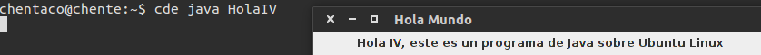
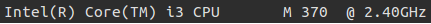
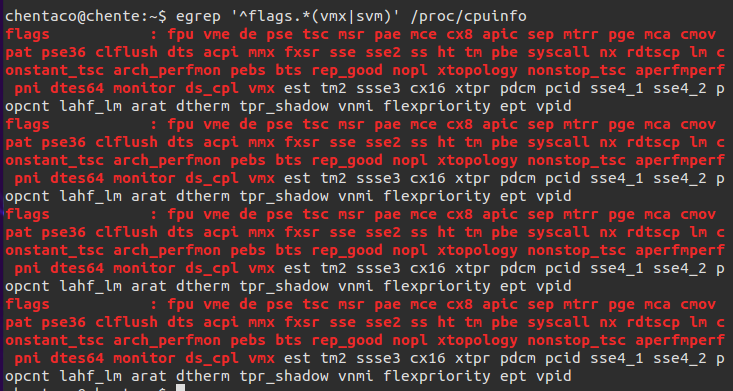
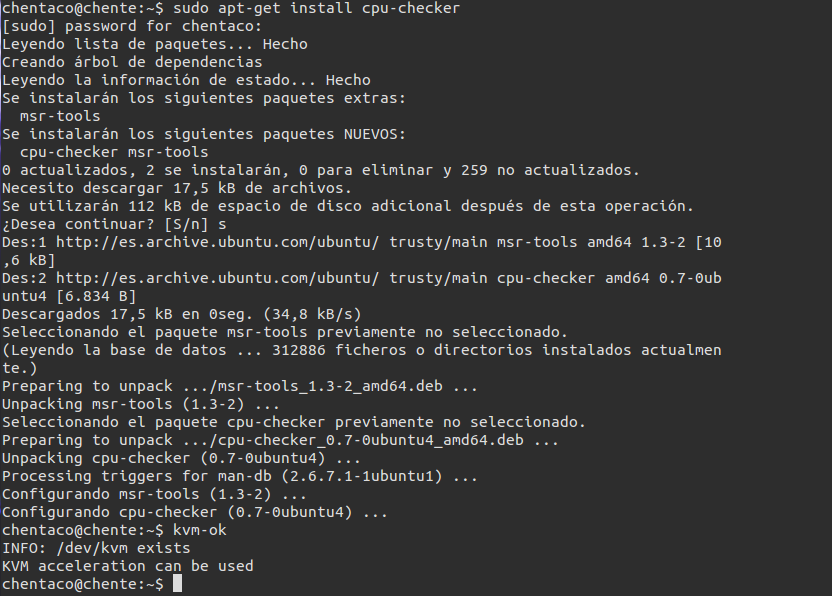

##Tema 1

###Ejercicio 1: Consultar en el catálogo de alguna tienda de informática el precio de un ordenador tipo servidor y calcular su coste de amortización a cuatro y siete años. [Consultar este artículo en Infoautónomos sobre el tema](http://infoautonomos.eleconomista.es/consultas-a-la-comunidad/988/).  
  

Según el artículo, para ahorrarse el IVA, lo amortiza en 4 años. Cada año pagaría máximo un 25 % del precio, por lo que asi podría pagarse en cuatro años. Si compramos un ordenador de 1000 € a principio de este año 2016, pagaríamos 250 € cada año durante cuatro años. Si en su lugar quisiesemos financialo en siete años, pagariamos alrededor de 142 € aprox. cada año. 

Estos dos casos son suponiendo que compremos el ordenador al principio de año. Si en su lugar lo compramos a mitad de año, ese pagaría un 50 % de la cuota de un año, y se alargaría 50 % de otro año más.

En mi caso he encontrado [este servidor](http://infasi.com/servidor_torre_intel_xeon_e3v5?gclid=CjwKEAjwydK_BRDK34GenvLB61YSJACZ8da3gTobHxVmvvzk6OqzuYy6zq_GxKz4hwm0WDPr7DrsexoCP_Hw_wcB) ya que indica el IVA a parte (con IVA son 949,48 € y sin IVA son 784,69 €)

Suponiendo que lo compro a principios de 2017, si quiero financiarlo en 4 años, tendría que pagar en primer lugar el IVA, para descontarlo ya, que serian 164,79 € y debería pagar el primer trimestre. Después pagar 196 € aprox. cada año durante 4 años:  

* 2017: 25 % de 784,69 € -> 196 €
* 2018: 25 % de 784,69 € -> 196 €
* 2019: 25 % de 784,69 € -> 196 €
* 2020: 25 % de 784,69 € -> 196 €  
* **TOTAL**: 784,69 € aprox. + IVA que pagamos el primer trimestre.

Sin embargo, si se amortiza a 7 años, cada año pagaríamos menos, iría descendiendo desde el 25 % que pagaríamos el primer año hasta el séptimo, donde pasaríamos a pagar 5 %:  
  
* 2017: 25 % de 784,69 € -> 196 €
* 2018: 25 % de 784,69 € -> 196 €
* 2019: 15 % de 784,69 € -> 117,7 €
* 2020: 15 % de 784,69 € -> 117,7 €
* 2021: 10 % de 784,69 € -> 78,46 €
* 2022: 5 % de 784,69 € -> 39,23 €
* 2023: 5 % de 784,69 € -> 39,23 €
* **TOTAL:** 784,69 € aprox. + IVA que pagamos el primer trimestre.


###Ejercicio 2: Usando las tablas de precios de servicios de alojamiento en Internet y de proveedores de servicios en la nube, Comparar el coste durante un año de un ordenador con un procesador estándar (escogerlo de forma que sea el mismo tipo de procesador en los dos vendedores) y con el resto de las características similares (tamaño de disco duro equivalente a transferencia de disco duro) en el caso de que la infraestructura comprada se usa sólo el 1% o el 10% del tiempo.  


[1and1.es](https://www.1and1.es/) ofrece ambos servicios [[1](https://www.1and1.es/servidores-virtuales), [2](https://www.1and1.es/que-es-cloud-computing)]. Suponiendo que tenemos que coger un procesador parecido, he optado por el **Servidor Cloud XXL**, de 4 núcleos, y para la nube, el **L4i** en el caso del servidor, también de 4 núcleos.

El precio del primero: 50 € al mes  
El precio del segundo: 60 € al mes

Para el precio del servidor, esta web no nos permite hacer precio si se usa el 1 %


###Ejercicio 3: ¿Qué tipo de virtualización usarías en cada caso?

[Enlace a la respuesta en el foro](https://github.com/JJ/IV16-17/issues/1#issuecomment-251697316).  
  
###Crear un programa simple en cualquier lenguaje interpretado para Linux, empaquetarlo con CDE y probarlo en diferentes distribuciones.  
  
Creé un programa en java que ejecuté con CDE. En primer lugar necesitaba instalar el CDE, que lo hice con el comando ```sudo apt-get install cde```  

Una vez instalado, lo ejecuté con el siguiente comando:  
  

###Ejercicio 4: Comprobar si el procesador o procesadores instalados tienen estos flags. ¿Qué modelo de procesador es? ¿Qué aparece como salida de esa orden?  
  
En primer lugar miré en ```/proc/cpuinfo``` el modelo de mi procesador:  
  
  
Lo segundo fue usar el siguiente comando para mirar los flags, y esto fue lo que apareció:  
  
  
###Ejercicio 4: Comprobar si el núcleo instalado en tu ordenador contiene este módulo del kernel usando la orden kvm-ok.  
  
El paquete no está instalado por defecto, así que lo instalamos y lo ejecutamos. Nos mostrará algo tal que:  
  
  

###Instalar un hipervisor para gestionar máquinas virtuales, que más adelante se podrá usar en pruebas y ejercicios.  
  
El hipervisor que yo he instalado ha sido [VirtualBox](https://www.virtualbox.org/) ya que, además de ser gratuito, ofrece soporte en Linux.