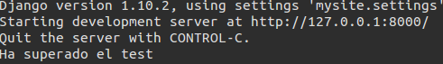

##Tema 2

###Ejercicio 1. Instalar alguno de los entornos virtuales de node.js (o de cualquier otro lenguaje con el que se esté familiarizado) y, con ellos, instalar la última versión existente, la versión minor más actual de la 4.x y lo mismo para la 0.11 o alguna impar (de desarrollo).    
  
En mi caso voy a utilizar Python en su virtualenv. Para ello he usado el siguiente comando:    
  
```sudo pip virtualenv```
  
  
Para activarlo y desactivarlo:    
  
* ```source bin/active```  para activarlo  
* ```deactivate``` para desactivarlo  

Como vemos en la siguiente imagen, la versión que usa por defecto es la 2.7.6: 
   
  

Sin embargo puedo usar la versión que quiera indicandolo al crear el virtualenv. En caso de que quiera usar python3 (la última versión):  
  
```virtualenv -p python3 nombre```
  

#Nota: Los ejercicios del 2 al 6...
Para realizar los ejercicios del 3 al 6 he utilizado el programa de encuestas realizado en el ejercicio 2. Puedes echarle un ojo [aquí](https://github.com/Chentaco/encuestasIV). El Python utilizado para esta aplicación ha sido Python2.

###Ejercicio 2. Como ejercicio, algo ligeramente diferente: una web para calificar las empresas en las que hacen prácticas los alumnos. Crear un repositorio en GitHub para la librería y crear un pequeño programa que use algunas de sus funcionalidades. Si se quiere hacer con cualquier otra aplicación, también es válido. Se trata de hacer una aplicación simple que se pueda hacer rápidamente con un generador de aplicaciones como los que incluyen diferentes marcos MVC. Si cuesta mucho trabajo, simplemente prepara una aplicación que puedas usar más adelante en el resto de los ejercicios.  

Como no tenía claro que framework quería usar, y nunca he usado uno, usé el [tutorial de Django](https://docs.djangoproject.com/es/1.10/intro/tutorial01/) para crear una aplicación de encuestas. Lo primero es instalar Django **en nuestro virtualenv**:  
  
```pip install Django```  
  
La versión de Django que me instala es la última, en mi caso:   
  
  

Lo siguiente es indicar que vamos a crear un proyecto django:  
  
```django-admin startproject nombre```  

Donde ***nombre*** es el nombre de nuestro proyecto.  
  
También podemos encender el servidor siempre que queramos con el siguiente comando:  
  
```python manage.py runserver```  
  
  
  
Siguiendo el tutorial he creado la aplicación donde:  

* Puedo ver una lista de las encuestas creadas.
* Puedo consultar cada pregunta.
* Ver los resultados de dicha pregunta.
* Puntuar la pregunta.
* Acceder al panel de administración, donde puedo seguir añadiendo nuevas encuestas.  
 
  
  
La versión de Python utilizada para este programa ha sido Python2.

###Ejercicio 3. Ejecutar el programa en diferentes versiones del lenguaje. ¿Funciona en todas ellas?

Como he realizado el programa en Python2, al ejecutarlo en la versión 3 no tengo ningún problema:  
  
  
  
Sin embargo, alrevés da errores. Es decir, si ejecuto un programa creador en Python3, en Python2 hay muchos errores de compatibilidad.  
 

###Ejercicio 4. Crear una descripción del módulo usando package.json. En caso de que se trate de otro lenguaje, usar el método correspondiente.  
  
Seguimos usando Python. Por lo que para crear un módulo de descripción, Python usa un archivo llamado **setup.py**. Dicho archivo necesita información como nuestro nombre, correo,... incluso de las dependencias que necesita nuestro programa. Si queremos consultar dicha dependencias, existe el comando siguiente:  
  
```pip freeze```  
  
En nuestro caso nos dice que depende de Django:  
  
  
  
Una vez que lo sabemos todo, solo hay que editar el archivo **setup.py**:  
  
  
  


###Ejercicio 5. Automatizar con grunt, gulp u otra herramienta de gestión de tareas en Node la generación de documentación de la librería que se cree usando docco u otro sistema similar de generación de documentatión. . Previamente, por supuesto, habrá que documentar tal librería.  

En Python, podemos hacer uso de una herramienta que se llama **Pydoc**. Dicha herramienta permite generar la documentación de nuestro programa. Muy similar a lo que hacia *javadoc* en java.  
  
Pydoc ya viene instalada junto a Python, por lo que no hay que instalar nada adicional, **sin embargo** es necesario importar a nuestro código pydoc, para poder usarlo (sin embargo nos saldrá el error de que "no hay información en nuestro código).  
  
Se puede usar el comando Pydoc con varios flags, sin embargo yo recomiendo el flag **-w**, que crea la documentación html en el directorio actual donde se ejecuta dicho comando.  
  
```pydoc -w nombre/```  
  
Donde ***nombre** es el directorio de nuestro proyecto.  
  
La documentación en html es útil por si queremos crear una documentación y acompañarla junto a nuestro código (guardarla en una carpeta doc, por ejemplo). Sin embargo hay otros flags útiles. Para más información: [Pydoc](https://docs.python.org/2/library/pydoc.html).

###Ejercicio 6. Para la aplicación que se está haciendo, escribir una serie de aserciones y probar que efectivamente no fallan. Añadir tests para una nueva funcionalidad, probar que falla y escribir el código para que no lo haga (vamos, lo que viene siendo TDD).  
  
Yo he creado un assert en el código donde carga el template del index. Se puede probar en cualquier sitio y de cualquier manera. Yo he optado por crear un assert que cuando no sea nulo la carga, diga que todo ha ido bien (muestra el mensaje **Ha superado el test**). Si observamos en la ventana de comandos sale la siguiente instrucción cuando llamo a dicha página:  

  
  
Como no es null, supera el test. ¿Pero y si fuera null el valor?  
  
  
  
En el código, he cambiado el valor a null y podemos ver que tenemos un error de Assertion.  

#Nota: A partir de este ejercicio...  
Los ejercicio 7 y 8 están realizados sobre mi proyecto de DAI/IV, no sobre la aplicación de encuestas que realicé y utilicé para los ejercicios anteriores. Puedes visitar mi aplicación en el siguiente [repositorio](https://github.com/Chentaco/Proyecto-IV). Así aproveché para realizar lo que pedía la práctica directamente sobre mi proyecto, y matar dos pájaros de un tiro. El Python utilizado para el proyecto es el 3. Sigue siendo Django el framework.

###Ejercicio 7. Convertir los tests unitarios anteriores con assert a programas de test y ejecutarlos desde mocha, usando descripciones del test y del grupo de test de forma correcta. Si hasta ahora no has subido el código que has venido realizando a GitHub, es el momento de hacerlo, porque lo vas a necesitar un poco más adelante.

Ya que ahora estoy trabajando directamente en mi proyecto, voy a hacer los tests comprobando que al crear un equipo, este tiene asignada una localidad, y un segundo tests que compruebe que los jugadores se pueden asignar a dichos equipos.   
  
Para ello, he configurado el archivo **tests.py** con dichas órdenes. Para no hacer más tedioso, puedes consultar el código dicho archivo [aquí](https://github.com/Chentaco/Proyecto-IV/blob/master/teams/tests.py).  
  
Para ejecutarlo, hay que usar el siguiente comando:  
  
```python manage.py test teams```  

Donde ***teams*** es el directorio donde se almacena el código, junto al código para hacer los tests, referido a los equipos de nuestra aplicación.  
  
Al ejecutarlo, obtenemos algo tal que asi:  
  
  
  
En caso de que algo no salga bien, error.
 
###Ejercicio 8. Haced los dos primeros pasos antes de pasar al tercero.

Antes de nada, es necesario darse de alta en alguna página que permita esto. Yo me logueé en [Travis CI](https://travis-ci.org/), que además de sencilla, permite identificarse con nuestra propia cuenta de **Github**.  
  
Nos iremos a nuestro perfil en Travis, veremos todos nuestros repositorios. Si ya lo tenemos subido nuestro proyecto, podemos activarlo para que Travis haga los tests sobre ese directorio.  
  

    
Después **necesitamos** añadir a dicho repositorio un archivo llamado de Travis llamado **.travis.yml**, el cual crearemos con la configuración de nuestro programa. Yo usé Python 3.5, por lo que mi archivo queda tal que así:  
  

``` 
language: python
python:
  - "3.5"
  - "3.5-dev" # 3.5 development branch
  - "3.6-dev" # 3.6 development branch
  - "nightly" # currently points to 3.7-dev
# command to install dependencies
install: "pip install -r requirements.txt"
# command to run tests
script: python manage.py test
```  
  
Importante editar la última línea, ya que ```pyton manage.py test``` es el archivo test que creamos en el ejercicio 7. Si todo ha ido correcto, y tras un push de este archivo a nuestro repositorio remoto, Travis hará las pruebas usando dicha configuración. Si todo ha ido bien, la página nos lo dirá y nos dará la siguiente "pegatina" indicando que nuestro proyecto ha pasado el test:  
  
[](https://travis-ci.org/Chentaco/Proyecto-IV)  ***Test de mi proyecto***
  
En caso contrario, la "pegatina" se mostrará en rojo, indicando que el test ha fallado. 