##Tema 3

###Ejercicio 1. Darse de alta en algún servicio PaaS tal como Heroku, Nodejitsu, BlueMix u OpenShift.

He elegido Heroku. Acudimos a su página [oficial](https://www.heroku.com/), y procedemos a registrarnos. A la hora de hacerlo, Heroku nos pregunta varios datos personales, e incluso el lenguaje primario en el que está programada nuestra aplicación (yo elegí Python, pues es el lenguaje que usa mi aplicación):  
  
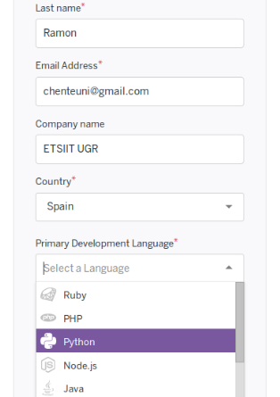  
  
  
Una vez completado el registro, este será el aspecto de nuestro panel inicial en Heroku:  
  
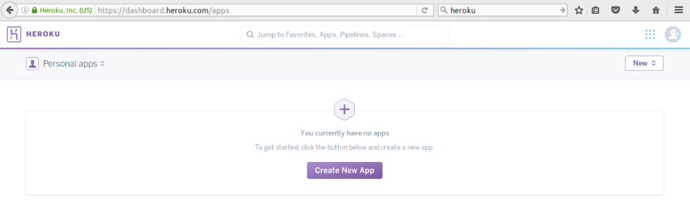  
  
Actualmente no tenemos nada en él. En el siguiente ejercicio crearemos un programa de prueba para poder visualizarlo.

###Ejercicio 2. Crear una aplicación en OpenShift o en algún otro PaaS en el que se haya dado uno de alta. Realizar un despliegue de prueba usando alguno de los ejemplos.

Intenté darme de alta en OpenShitf, ya que el propio registro se puede realizar con la propia cuenta de GitHub. Sin embargo, ya que realicé el registro en Heroku y existen tutoriales [[1]](https://devcenter.heroku.com/articles/getting-started-with-python#introduction), [[2]](https://devcenter.heroku.com/articles/deploying-python) para subir nuestra aplicación Python, me decanté por usarlo en este ejercicio.   
  
El tutorial además explica como realizar la subida de nuestro programa a Heroku a través de la linea de comando y utilizando la herramientas **Heroku CLI**. Dependiendo del SO que usemos, la instalación será descargando el programa (Windows) o instalándolo mediante la línea de comandos (Linux). Tras instalarlo, solo tenemos que loguear:  
  
```heroku login```  
  
Nos pedirá nuestro credenciales para loguear en nuestra cuenta de Heroku.  
  
Tras ello nos podemos decantar por dos formas de trabajar con nuestra aplicación:
  
* Si tenemos nuestro programa en un repositorio, podemos clonarlo con el comando ```git clone``` con la **url** del repositorio de nuestro proyecto, copiándolo en local y después subiéndolo a heroku.  
* Si deseamos trabajar con un repositorio nuevo, o lo tenemos en local, hay que indicar (o crear) el repositorio git. El comando ```git init``` indica que el directorio actual es un repositorio git.  
  
El tutorial ofrecía un [repositorio git](https://github.com/heroku/python-getting-started.git) de ejemplo, el cual ha sido el que yo he usado también en este ejercicio.  
  
Ahora, estando en el directorio de nuestra aplicación, ejecutamos el comando ```heroku create``` que creará nuestra aplicación junto a todo lo necesario para iniciar después la subida a heroku con ```git push heroku master```.  
  
**NOTA**: El comando ```heroku create``` otorga a nuestra aplicación un nombre generado aleatoriamente. En los próximos ejercicios, donde trabajo con mi proyecto, veremos como le doy el nombre que yo deseo.  
  
Heroku generó mi proyecto con el nombre **mysterious-gorge-57034**, por lo que para acceder a esta aplicación, utilizará la dirección **mysterious-gorge-57034.herokuapp.com** (no accesible actualmente, veremos a continuación por qué).  
  
La aplicación tiene el siguiente aspecto:  
  
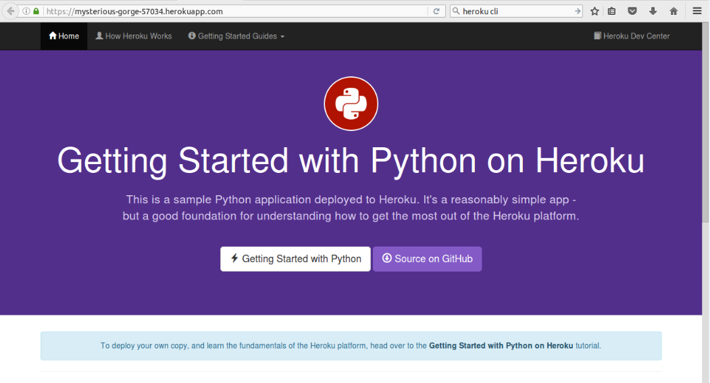  
  
Ahora, como yo no deseaba que tuviese ese nombre, le cambié el nombre manualmente. Accedí al proyecto desde la web de Heroku. En el apartado **Setting > Name** le cambié el nombre por **chentaco1**.  
  
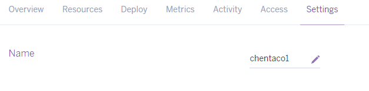  
  
Puedes visitar esta aplicación desde [http://chentaco1.herokuapp.com/](http://chentaco1.herokuapp.com/)  
  
-------------------------------------------
  
**NOTA 2:** A partir de aquí, como lo siguiente lo tengo que realizar también en mi aplicación propia final, he optado por utilizar mi proyecto y realizar los siguientes ejercicios sobre ella.  
  
-------------------------------------------

###Ejercicio 3. Realizar una app en express (o el lenguaje y marco elegido) que incluya variables como en el caso anterior.  
  
En lugar de utilizar **express**, ya que he utilizado Python y además Django, este último ofrece la herramienta de **Django Rest**. Para realizarlo, me he quitado del [siguiente tutorial](http://www.django-rest-framework.org/tutorial/1-serialization/).  
  
Resumiendo un poco lo que he hecho. Tras instalar el paquete django-rest con ```pip install djangorestframework```, he creado el fichero de **serializers.py** de nuestro proyecto con información sobre la clase *Serializer*. Puedes consultar el código en [dicho archivo](https://github.com/Chentaco/Proyecto-IV/blob/master/teams/serializers.py).  
  
**NOTA 3**: Hay que indicar en el archivo **settings.py** de nuestro programa que ahora estamos utilizando Django Rest:  
  
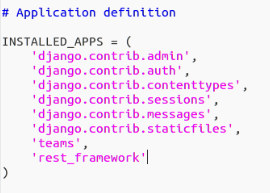
  
Destacar del código:  
  
* Método *create*. Crea una instancia y además la valida sobre los equipos de nuestro programa.
* Método *update*. Actualiza y devuelve una instancia sobre los equipos de nuestro programa.  
  
Para probar la clase *Serializer* que acabamos de implementar, lo único que hay que probar es, desde el **shell** de Python, a introducir valores. En nuestro caso, crear equipos nuevos o actualizarlos:  
  
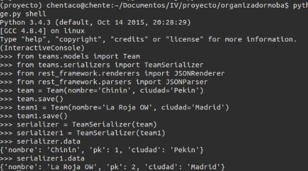  
  
Donde:  
  
* nombre: El nombre del equipo  
* pk: El id del equipo  
* ciudad: La ciudad del equipo  
  
También podemos utilizar JSon en lugar de nuestra clase Serializer. Para ello:  
  
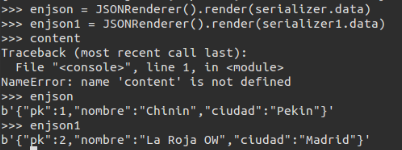  
  
Como vemos, en esta ocasión pone la *primary key* en primer lugar.  
  
Visto como es en JSON, podemos hacer que nuestro resultados se muestren así cuando hagamos las consultas desde la app en la web. Para ello, en el archivo **views.py** he creado lo siguiente:  
  
* Una clase **JSONResponde**, la que se encargará de renderizar las peticiones HTTP en JSON.
* Un método para listar todos nuestros equipos de la base de datos: **lista_team**.
* Un método para listar en concreto a un equipo a través de su *pk*: team_detail.
  
Puedes visualizar el código en el [siguiente enlace](https://github.com/Chentaco/Proyecto-IV/blob/master/teams/views.py).  
  
Ahora, si accedemos desde el navegador a nuestra aplicación, el resultado es el siguiente:  
  
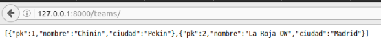  
  
Si queremos visualizar en concreto un equipo, a través de su *pk*, utilizaremos el número de esta para visualizarlo. Es decir, si quiero ver aquel equipo cuyo pk=1, el enlace será /teams/1/:  
  
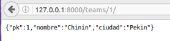  
  
**NOTA 4**: Es importante indicar en nuestro archivo de **urls.py** las urls para acceder a la visualización del listado de equipos o a un equipo en concreto. Para ello añadimos:  
  
```
url(r'^teams/$',views.lista_team),
url(r'^teams/(?<pk>[0-9]+)/&'
```  
  

###Ejercicio 4. Crear pruebas para las diferentes rutas de la aplicación.  
  
Como hemos visto, podemos acceder a */teams/, /teams/<numero>/* para ver un listado de todos los equipos o un equipo en concreto a través de su *primarykey*.  
  
Ahora, para estas rutas, modificaré mi archivo de **tests.py** que ya usamos en la práctica anterior para que, en esta ocasión, se compruebe que:  
  
* Son rutas correctas. En caso de serlas, HTTP envia el código **200**. En caso contrario, el de error, **404**.
* El contenido recibido es JSON, ya que es lo que hemos hecho en el *ejercicio 3*.  
 
Para ambos casos hay que utilizar **self.assertEqual**. En el primer caso, con el código de respuesta y compararlo con el 200. Para el segundo no se mira el código, sino el contenido y lo compara con los de tipo **json**. Hay que probarlo tanto para ambos casos: el listado de los equipos o ver un equipo en concreto.  
  
Recordemos que para ejecutar nuestro test desde la ventana de comandos, se usaba ```python manage.py test```. Si todo ha ido bien, como ha sido en mi caso, el resultado es el siguiente:  
  
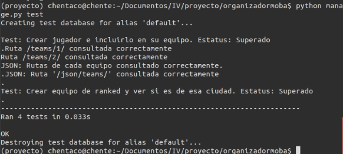  
  


###Ejercicio 5. Instalar y echar a andar tu primera aplicación en Heroku.  
  
Seguí de nuevo el tutorial mencionado en el **Ejercicio 2**. Los pasos son *casi* los mismo que en él, salvo con algunas cosas que hay que tener en cuenta:  
  
* Necesitamos loguear con ```heroku login``` y estar en un repositorio git local.
* Tras ello es importante fijarnos en nuestra aplicación, en qué usa, en qué tiene configurado, etc. **Mi aplicación** por ejemplo, necesitaba un path para indicar el contenido estátido que se formaría al crear la aplicación con ```heroku create```, si no, cuando vayas a subir tu aplicación a heroku, van a saltar muchos errores. En mi caso, tuve que indicar en el archivo **settings.py** tanto **STATIC ROOT** como el **STATIC URL** e indicar en ambos mi path de la carpeta static. Además el tutorial indica que hay que instalar **whitenoise**, para que los archivos estáticos se configuren correctamente. [Más información](http://whitenoise.evans.io/en/stable/django.html).
* Es necesario crear un archivo llamado **Procfile**, para indicar a Heroku qué tiene que ejecutar. Según el tutorial y mi proyecto, el contenido de dicho archivo es ```web: gunicorn MOBAgestor.wsgi --log-file -```. Pero, ¿qué es gunicorn? Es un paquete que sirve para utilizar de servidor WSGI el archivo que le indiquemos, en nuestro caso **MOBAgestor**.  
* Hay que fijarse en nuestra versión de Python. Heroku por defecto utiliza Python2. Si queremos indicarle que versión de Python queremos que utilice, hay que crear un archivo llamado **runtime.txt** e indicarle la versión en la que deseamos ejecutar nuestra aplicación. En mi caso solo puse ```python-3.5.2```. 
* Antes de subir nada y crear la aplicación, es importante actualizar (o crear si no existe) el archivo **requeriments.txt**. Para ello, ejecutamos ```pip freeze > requeriments.txt``` y el propio programa se encargará de actualizarlo con todos los programas necesarios para correr nuestra aplicación.
* Si ya está todo listo, creamos nuestra aplicación. Si queremos crearla con un nombre específico y no uno generado aleatoriamente, ejecutamos ```heroku app:create <nombre>``` (podemos añadir otros parámetros para indicarle el idioma y demás). Aunque hemos visto que se puede modificar después, esto puede causar problemas si estamos trabajando con git, ya que volverá a subir la aplicación con el nombre antes de cambiarlo u otros errores. Puedes usar ```git remote rm heroku``` para borrar la aplicación actual, y crearla de nuevo con un nuevo nombre.  
* Procedemos a su subida con ```git push heroku master```, donde **si todo ha ido bien**, no nos habrá salido ningún error y ya podemos proceder a ver nuestra aplicación desde heroku. Para abrirla desde la ventana de comandos: ```heroku open```.

Podemos ver mi app en heroku, donde dependiendo del path se mostrará cada una de las cosas definidas en él, es decir:  
  
* [/match/teams/](http://mobagestor.herokuapp.com/match/teams/)  
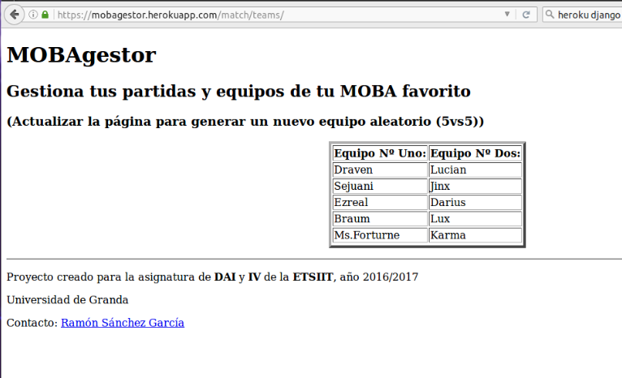  
  
* [/teams/](http://mobagestor.herokuapp.com/teams/)  
  
  
* [/teams/1/](http://mobagestor.herokuapp.com/teams/1/)  
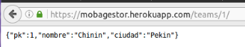  
  
**NOTA 5**: En el path (/) no hay nada definido, por lo tanto, actualmente, si accedes saldrá un error.
  
 
###Ejercicio 6. Usar como base la aplicación de ejemplo de heroku y combinarla con la aplicación en node que se ha creado anteriormente. Probarla de forma local con foreman. Al final de cada modificación, los tests tendrán que funcionar correctamente; cuando se pasen los tests, se puede volver a desplegar en heroku.

Ya hemos visto como funciona la aplicación en remoto. En local se ejecutaría con:  
```heroku local```  
  
Para ejectuarla con foreman, antes necesitamos instalarla:  
  
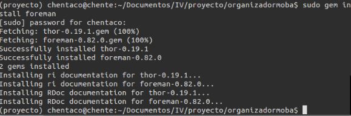  
  
Después la ejecutamos con ```foreman start web```:  
  
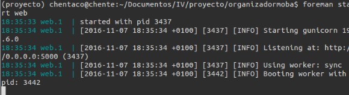  
  
Como podemos comprobar, la web funciona desde nuestro navegador (y el puerto 5000):  
  
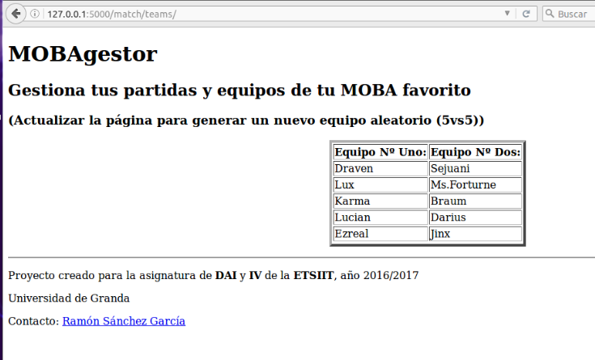  
  

###Ejercicio 7. Haz alguna modificación a tu aplicación en node.js para Heroku, sin olvidar añadir los tests para la nueva funcionalidad, y configura el despliegue automático a Heroku usando Snap CI o alguno de los otros servicios, como Codeship, mencionados en StackOverflow.  
  
Accedemos a la web de [Snap-CI](https://snap-ci.com). Podemos entrar con nuestra cuenta de GitHub, por lo que es bastante cómodo el registro. Una vez dentro, necesitamos sincronizar nuestra cuenta de Github con esta web, por lo que tendremos que darle permisos. Después, la web nos dirá que sobre qué repositorio de nuestra cuenta de Github queremos trabajar:  
  
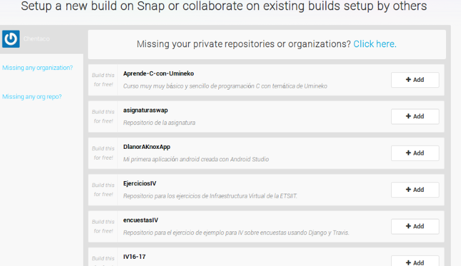  
  
En mi caso, elegí la del propio proyecto con el que estamos trabajando en estos últimos ejercicios. La web empezará a realizar tests por defecto que tiene creados. Tendrá el siguiente aspecto:  
  
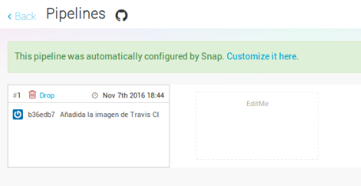  
  
Bien, una vez aquí, lo siguiente será volver a Heroku, al repositorio de nuestro proyecto. Necesitamos añadir una nueva **pipeline**:  
  
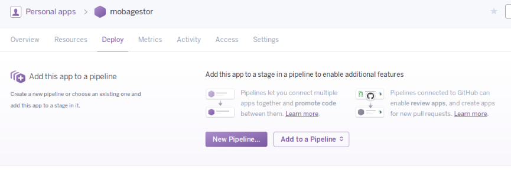  
  
Sincronizaremos a ella nuestro directorio de GitHub donde tenemos el mismo proyecto con el que estamos trabajando. Después buscaremos la opción **Automatic deploys > Enable Automatic Deploys** permitiendo así que lo realize de forma automática:  
  
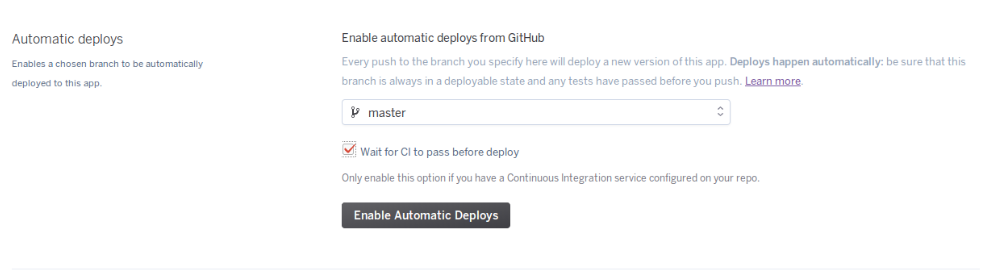  
 
Volvemos a **Snap-CI**, donde crearemos un Test personalizado desde las opciones. A dicho test le diremos que, por comandos, ejecute las siguientes órdenes:  
  
```
pip install -r requeriments.txt
python manage.py test
```  
  
Donde:  
  
* La primera orden ejecuta la instalación de todos los programas indicados en el archivo de testo **requements.txt**.
* La segunda ejecuta el test anteriormente establecido para realizar las pruebas que hicimos en local.  
  
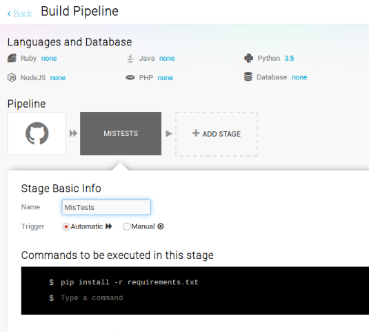  
  
Si todo ha ido bien, los test se realizarán automáticamente:  
  
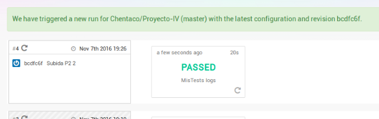  
  
Un indicativo de que todo ha ido bien es obtener el "botón" de la build:  

[](https://snap-ci.com/Chentaco/Proyecto-IV/branch/master)
  
###Ejercicio 8. Preparar la aplicación con la que se ha venido trabajando hasta este momento para ejecutarse en un PaaS, el que se haya elegido.  
  
Supongo que el ejercicio dice que utilicemos nuestro proyecto. Como hemos visto, a partir del **ejercicio 3** he utilizado mi aplicación para hacer dos cosas en una. Puedes ver los ejercicios en este mismo documento.  
  
Ahora he creador un botón para permitir a quien sea acceder a mi aplicación en el PaaS de Heroku. Utilicé [este otro tutorial](https://devcenter.heroku.com/articles/heroku-button). Resumiéndolo un poco, este tutorial dice que se necesita un archivo **json** en nuestro repositorio de GitHub con el código:  
  
```
{
  "name": "MOBAgestor",  
  "description": "Gestor de partidas de tus MOBA favoritos",  
  "repository": "https://github.com/Chentaco/Proyecto-IV",  
  "logo": "https://node-js-sample.herokuapp.com/node.png",  
  "keywords": ["node", "express", "static"]  
}  
```  
  
Después hay que validar dicho archivo, usando el CLI o directamente desde el navegador con el siguiente link:  
  
```
https://heroku.com/deploy?template=https://github.com/Chentaco/Proyecto-IV/tree/master
```  

  
Finalmente solo hay que utilizar la imagen del botón y el link a nuestro GitHub como indica el tutorial:  
  
```[](https://heroku.com/deploy?template=https://github.com/Chentaco/Proyecto-IV/tree/master```  
  
    
El resultado:  
  
[](https://heroku.com/deploy?template=https://github.com/Chentaco/Proyecto-IV/tree/master)