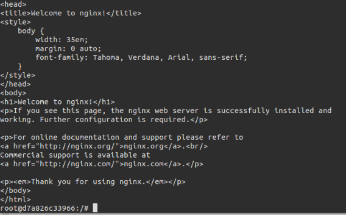

## Tema 4

### Ejercicio 1. Instala LXC en tu versión de Linux favorita. Normalmente la versión en desarrollo, disponible tanto en GitHub como en el sitio web está bastante más avanzada; para evitar problemas sobre todo con las herramientas que vamos a ver más adelante, conviene que te instales la última versión y si es posible una igual o mayor a la 1.0.

Para instalar el paquete, basta con utilizar el comando:  
  
```sudo apt-get install lxc```  
  
Una vez instalado, podemos usar el comando ```dpkg -s lxc``` para ver la versión instalada. En mi caso:  
  
  
  
En los próximos ejercicios vamos a usar deboostrap y lxc-templates, para crear nuestros contenedores. Esta versión ya me los han instalado, pero en caso de que no lo haya hecho, tienes que instalarlo a mano.  

### Ejercicio 2. Comprobar qué interfaces puente se han creado y explicarlos.
 
Para ello voy a crear e iniciar un contenedor de prueba:  
  
```sudo lxc-create -t ubuntu -n ContenedorUbuntu```  Para crearlo
  
  
  
**NOTA 1**: Como podemos ver en la captura, nos dice que por defecto, el usuario y su contraseña es "ubuntu".  


```sudo lxc-start -n ContenedorUbuntu``` Para arrancarlo  
  
  
  
Ahora, para ver las interfaces puente, basta con mirar tanto en la máquina cliente como la servidora. Para ello hay que usar **ifconfig:**  

  

Podemos observar que se han creado dos interfaces. Según la [documentación de LXC](https://linuxcontainers.org/lxc/manpages/man5/lxc.container.conf.5.html) donde **lxcbr0** hace referencia a la conexión "puente" con el host, pudiendose asi conectar a internet usando la misma configuración que la máquina anfritiona; mientras que la otra que se ha creado es la correspondiente a localhost.  

### Ejercicio 3.1. Crear y ejecutar un contenedor basado en Debian.  
  
Creamos un nuevo contenedor y lo lanzamos. Esta vez el comando para crear un contenedor de Debian es:  
  
```sudo lxc-create -t debian ContenedorDebian```  
  
El comando para ejcutarlo es el mismo que en el apartado anterior. Sin embargo, vemos que nos suelta el siguiente error:  


  
Para arreglarlo, una web ofrecía una solución, que era instalando el paquete  ```apt-get install lxcfs``` y reiniciando el contenedor. 
  
### Ejercicio 3.1. Crear y ejecutar un contenedor basado en otra distribución, tal como Fedora.  
  
Yo empecé creando un contenedor basado en ***ArchLinux***. Aunqueequiere de pacman, su gestor de paquetes el cual instalé antes de crear el contenedor, es otro el motivo por el que no he 
conseguido crear un contenedor asi. [Según este foro](http://askubuntu.com/questions/610081/how-to-create-archlinux-lxc) se debe a un error o un "bug" de compatibilidad con mi versión de Ubuntu.  
  
La alternativa, fijándome además la da de ejemplo en el Ejercicio 7 y requiere de su uso, fue crear el contenedor en **CentOS**. Para ello, para
crearla:  
  
```sudo lxc-create -t centos ContenedorCentOS```  
  
  
  
**NOTA 2**: CentOS requiere de **yum**, al igual que ArchLinux requeria pacman. Asi que antes de crear el contenedor, hay que instalarlo en la maquina anfitriona:  
  
```sudo apt-get install yum```  
  
Además es necesario cambiar la contraseña la primera vez que se arranque. Hay varias formas de hacerlo, yo me decanté por la siguiente:
  
  
  
### Ejercicio 4. Instalar lxc-webpanel y usarlo para arrancar, parar y visualizar las máquinas virtuales que se tengan instaladas. 

Según [la web oficial](https://lxc-webpanel.github.io/install.html) hay que usar el siguiente comando:  
  
```wget https://lxc-webpanel.github.io/tools/install.sh -O - | bash```  

**NOTA 3**: Como podemos ver, necesitamos ser root para poder instalarlo (el propio instalador nos lo dirá si no estamos):  
  
  

Después abrir la direccion loclahost, puerto 5000, y utilizar admin admin. El panel tendrá el siguiente aspecto:  

  
  
Desde aquí podemos parar, arrancar, pausar los contenedores. También podemos ver la información asociada a cada contenedor y configurarlo. 
  
### Desde el panel restringir los recursos que pueden usar: CPU shares, CPUs que se pueden usar (en sistemas multinúcleo) o cantidad de memoria.   

He cogido por ejemplo el de ContenedorUbuntu. Lo seleccionamos en el menú lateral izquierdo, y desde la nueva pantalla, modificamos el valor de "Memory limit" al deseado. En mi caso, 512 MB:  
  
  
  
### Ejercicio 5. Comparar las prestaciones de un servidor web en una jaula y el mismo servidor en un contenedor. Usar nginx. 

Trabajo sobre mi contenedor ContenedorUbuntu, creado en el primer apartado. Lo arrancamos y sobre él instalamos nginx:  
  
```sudo apt-get install nginx```  
  
Para comprobar que está instalado, podemos abrir la direccion del contenedor desde un navegador:  
  
  

Recordando lo dado el año pasado en una asignatura, para realizar los test de carga se puede utilizar la herramienta apache benchmark. Para ello instalamos en el contenedor:  
  
```sudo apt-get install apache2-utils```  

Ahora, para realizar el test, utilizo el siguiente comando:  
  
```ab -n 2000 -c 500 http://10.0.3.223/``` 
  
Donde hago 2000 peticiones, a un nivel de concurrencia de 500, sobre la dirección del contenedor. Cada uno puede poner la que quiera.  

  
  
Ahora paso a la segunda parte del ejercicio, a utilizarlo en una jaula. Para ello me he servido de estas web ([1](https://www.cyberciti.biz/faq/howto-run-nginx-in-a-chroot-jail/), [2](http://blog.dornea.nu/2016/01/15/howto-put-nginx-and-php-to-jail-in-debian-8/)),  donde indica paso a paso lo que hay que hacer. Yo voy a resumir varias cosas importantes de este proceso:  
  
* Hay que crear el directorio que será nuestra "jaula" (por ejemplo **$JAIL**) y en él los directorios de **etc, dev, usr, var** y darles permisos.  
* Copiar a dicha jaula los archivos para poder usar nginx, todos ellos están en la carpeta de instalación de nuestro nginx (puede ser diferente, en mi caso estaba en **/etc/nginx/**)  
* Otorgar permisos correspondientes. El propio tutorial dice que a **null** y **random** hay que otogarles **0666**; **0444** a **urandom**.  
* Matar los procesos de nginx que tengamos ejecutados antes de ejecutar el enjaulado, asi evitamos conflictos o resultados erróneos.  
* Finalmente ejecutar el daemon.   

### Ejercicio 6. Instalar Docker. 

Utilizo el comando:   
  
```wget -qO- https://get.docker.com/ | sh```  
  
Asi se instala **docker** en nuestro sistema. Lo que hay que hacer ahora es añadir el usuario actual, es decir, con el que trabajabamos, al grupo **docker**, evitándonos asi tener que utilizar el root o el sudo. Para ello:  

```sudo usermod -aG docker chentaco```  
  
  Es muy importante que tras hacerlo, haya que reiniciar, para que los cambios se guarden. A partir de ahora podemos trabajar con docker sin necesidad de prermiso de superusuario y demás.  
    
 Realizamos a continuación la prueba, tal y como dice [su tutorial oficial](https://docs.docker.com/linux/step_one/), con el *hello_world*, para ello:  
   
   
   
 Como podemos observar, todo funciona correctamente.  
   
### Ejercicio 7. Instalar a partir de docker una imagen alternativa de Ubuntu y alguna adicional, por ejemplo de CentOS. Buscar e instalar una imagen que incluya MongoBD.
  
Debemos acceder a la página donde están las imagenes, la página de [Docker](https://hub.docker.com/):  
  
   
   
Desde ella, busco las imágenes de **Ubuntu**, y **CentOS**. Nos indicará qué comandos hay que utilizar para descargarlas, que son:  

```
docker pull ubuntu  
docker pull centos  
```
Además el ejercicio nos pide que instalemos una imagen con **MongoDB**, podemos instalar la oficial con:  
  
 ```docker pull mongo```  
   
 Para visualizar las imagénes instaladas solo hay que correr el comando ```docker images```:  
   
   
   
### Ejercicio 8. Crear un usuario propio e instalar nginx en el contenedor creado de esta forma.  

Trabajo directamente sobre la imagen de Ubuntu. En primer lugar, la arrancamos:  
  
```docker run -i -t ubuntu /bin/bash```  
  
Dentro de la máquina podemos crear el usuario tal y como se haría en ubuntu:  
  
```àdd user chentaco```
   
 En la máquina, con apt-get, instalamos nginx y lo encendemos. Si queremos comprobar que funciona, podemos acceder desde la máquina anfritriona al servidor del contenedor, o acceder al contenido con un curl mismo.  
 
   

### Ejercicio 9. Crear a partir del contenedor anterior una imagen persistente con commit.
 
 Sigo trabajando sobre Ubuntu. Tal y como dicen la documentación de este tema, en primer lugar hay que ver la id del contenedor con ```docker  ps -a ```:  
 
   
 
 Después realizaremos el commit, añadiendo la ID de nuestra imagen y una etiqueta:   
   
    
 
### Ejercicio 10. Crear una imagen con las herramientas necesarias para el proyecto de la asignatura sobre un sistema operativo de tu elección.

Lo primero que he hecho ha sido registrarme en la página de [Docker](https://docker.com). Una vez hecho, hay que tener en cuenta varias cosas:  
  
 * Para crear el contenedor en local, en primer lugar hay que crear un archivo **Dockerfile**, con el que crearemos nuestro contenedor. Yo he elegido la última versión de **Ubuntu**:  
 
 ```
 FROM ubuntu:latest

#Autor
MAINTAINER Ramon Sanchez Garcia <chentaco@correo.ugr.es>

#Actualizar Sistema Base

RUN apt-get update && \
      apt-get -y install sudo

# Instalar Python
RUN sudo apt-get -y install python-setuptools
RUN sudo apt-get -y install python-dev
RUN sudo apt-get -y install build-essential
RUN sudo apt-get -y install python-psycopg2
RUN sudo apt-get -y install libpq-dev
RUN sudo apt-get -y install python-pip
RUN sudo pip install --upgrade pip

#Descargar aplicacion
RUN sudo apt-get -y install git
RUN sudo git clone https://github.com/Chentaco/Proyecto-IV.git

#Instalar aplicacion
RUN cd Proyecto-IV/ && pip install -r requirements.txt
RUN cd Proyecto-IV/ && python manage.py migrate

#Puerto

EXPOSE 8000
 ```  
 
 
* Dicho archivo tiene que estar en el directorio de nuestra aplicación. Para crear el contenedor, ahora utilizamos el comando:  
 ```docker build -f Dockerfile -t ubuntumobagestor .``` IMPORTANTE EL PUNTO.  
   
 * Si todo ha ido bien, se habrá creado localmente la imagen:  
 
   
   
  * La arrancamos para hacer pruebas con ```docker run -i -t ubuntumobagestor /bin/bash```.   
 
 Para subirla, se realizará con un push. Antes de nada habrá que logear con nuestro credenciales, usando ```docker login```. Después habrá que hacer **push** de la imagen.  
 **NOTA 3**: Para poder subir nuestro contenedor a un repositorio de docker, hay que crear la imagen de la forma **<nombre usuario docker>/imagen**, en mi caso **chentaco/mobagestor**.    

 * Finalmente, para tener nuestro contenedor online, se necesita configurar un nodo, con algún sericio web (apache, azure..) y hacer correr la aplicación para verla online. Yo no dispongo de ella, asi que lo que he realizado es un script, descargable [AQUÍ](https://github.com/Chentaco/Proyecto-IV/blob/master/scriptdocker.sh). Tras ejecutarlo, el contenedor se descargará y se ejecutará en local. Parra arrancar el serivor solo hay que ejecutar el siguiente comando (no puedo añadirlo directamente al script):  

 ```python /Proyecto-IV/manage.py runserver 0.0.0.0:5500```  

 El servidor se ejecutará en la dirección del contenedor (en mi caso, 172.17.0.2:5500):  


   