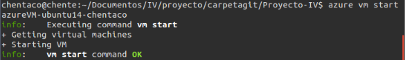
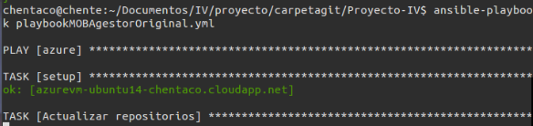
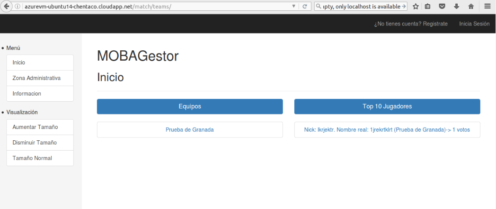
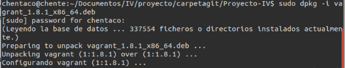
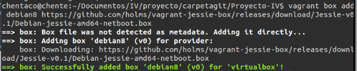
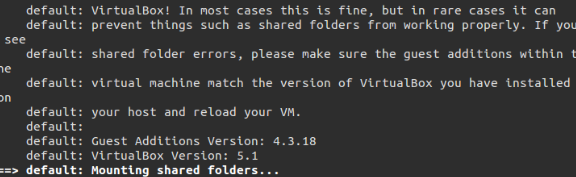
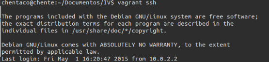
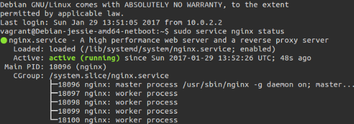

## Tema 6

### Ejercicio 1. Instalar chef en la máquina virtual que vayamos a usar.
Basta con usar el siguiente comando:  
```curl -L https://www.opscode.com/chef/install.sh | sudo bash```  

### Ejercicio 2. Crear una receta para instalar la aplicación que se viene creando en la asignatura en alguna máquina virtual o servidor en la nube.


### Ejercicio 3. Desplegar la aplicación de DAI con todos los módulos necesarios usando un playbook de Ansible.

En primer lugar instalo **Ansible**. Según su web, necesito tener todas las dependencias y demás. Por eso uso el siguiente comando:  

```sudo pip install paramiko PyYAML jinja2 httplib2 ansible```  

Recordemos que en el [tema5](https://github.com/Chentaco/EjerciciosIV/blob/master/tema5.md) usamos una máquina virtual de azure, que es sobre la que trabajaremos todo el proyecto. Hay que añadir entonces ese nombre a los hosts de ansible. Para ello la añado al archivo "ansible_hosts" y los exporto:  

```
echo "<nombreurl>.cloudapp.net" > ~/ansible_hosts  
export ANSIBLE_HOSTS=~/ansible_hosts
```  

Recordemos también que teníamos que tener el CLI de Azure, estar logueados, etc.  

Ahora, arrancamos la máquina de azure con ```azure vm start <nombreurl>```:  

  

Creamos un par de claves, pública y privada, para conectarnos a través de SSH sin que nos pida cada vez la contraseña:  

```
ssh-keygen -t dsa 
ssh-copy-id -i ~/.ssh/id_dsa.pub chentaco@azurevm-ubuntu14-chentaco.cloudapp.net
```  

**NOTA**: <nombreurl> aquí es "azurevm-ubuntu14-chentaco.cloudapp.net", que es el que yo le puse. Y "chentaco" es el usuario.  

Ahora pasamos a crear el **playbook**. Para ello, creé un archivo llamado "playbookMOBAgestor.yml" con el siguiente contenido:  

```
- hosts: localhost
  remote_user: vagrant
  become: yes
  become_method: sudo
  tasks:
  - name: Actualizar repositorios
    apt: update_cache=yes
    tags: 
    - apt-update
        
  - name: Instalar dependencias
    apt: name={{ item }}
    with_items:
      - python-setuptools
      - python-dev
      - build-essential
      - python-psycopg2
      - git
    tags:
    - dependencias
    
  - name: easy_install
    easy_install: name=pip
    tags:
    - pip
    
  - name: Descargar fuentes
    git: repo=https://github.com/Chentaco/Proyecto-IV.git dest=~/appDAI force=yes
    tags:
    - fuentes
    
  - name: Instalar requirements
    pip: requirements=~/appDAI/requirements.txt
    tags:
    - requirements  

  - name: Lanzar app
    command: nohup python ~/appDAI/manage.py runserver 0.0.0.0:80
    tags:
    - app
```  

Destacar sobre este código que indico las dependencias, las fuentes de mi aplicación, los requeriments, etc.  

Lo ejecuto con: ```ansible-playbook playbookMOBAgestor.yml```  

  

  

Podemos visitarla en http://azurevm-ubuntu14-chentaco.cloudapp.net  

  
### Ejercicio 4. Instalar una máquina virtual Debian usando Vagrant y conectar con ella. 

Desde las prácticas de DAI hemos usado la versión Vagrant 1.8, la cual ya tengo instalada. En el caso de que no, solo hay que ir a la página oficial de [Vagrant](https://www.vagrantup.com/downloads.html), descargar tu versión e instalarla. También puedes hacerlo mediante el gestor de paquetes o por comandos (dpkg).  

  

Ahora bajo una imagen de Debian. De nuevo, en la página de Vagrant hay un listado de imagenes de bastantes sistemas operativos. Solo hay que bajar el que deseemos. En mi caso uno con guest-additions:  

```
vagrant box add debian8 https://github.com/holms/vagrant-jessie-box/releases/download/Jessie-v0.1/Debian-jessie-amd64-netboot.box
```  

  

Creo el archivo Vagrantfile por defecto con ```vagrant init``` (se creará en el directorio actual), y la arranco con ```vagrant up```.  

  

Para entrar a ella, basta con usar el comando ```vagrant ssh```:  

  

  
### Ejercicio 5. Crear un script para provisionar `nginx` o cualquier otro servidor web que pueda ser útil para alguna otra práctica

En si no hay que crear ningún scrip en especial. Basta con abrir nuestro **Vagrantfile** y añadir:  

```
config.vm.provision "shell", inline: 
	"sudo apt-get update"
	"sudo apt-get -y install nginx && service nginx start"
```  

De esta forma, se actualizarán los paquetes, instalará nginx y lo arrancará. Si volvemos a entrar en la máquina, vemos que está funcionando:  

  

**NOTA 2**: Es necesario que, cuando queramos que esto funcione, en lugar de arrancar la máquina con "vagrant up" usemos ```vagrant provision```.  


### Ejercicio 6. Configurar tu máquina virtual usando vagrant con el provisionador chef.

En esta parte de la práctica he tenido MUCHOS problemas. Principalmente por chef. Es un provisionador con el que no me he terminado de aclarar, y que al instalar **chef_solo** no deja de darme problemas. Al final he optado, Y DE CARA AL HITO FINAL, optar por usar **Ansible**.  

Además, como suelo hacer, aprovecho para realizar el hito final de la asignatura en este ejercicio. Explico TODO detalladamente paso a paso en su, [https://github.com/Chentaco/Proyecto-IV/tree/master/doc/hito5.md](documentación).

